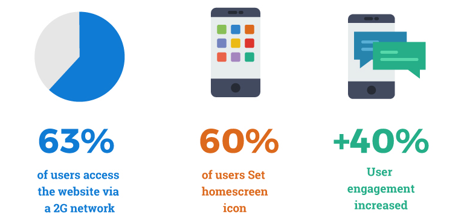
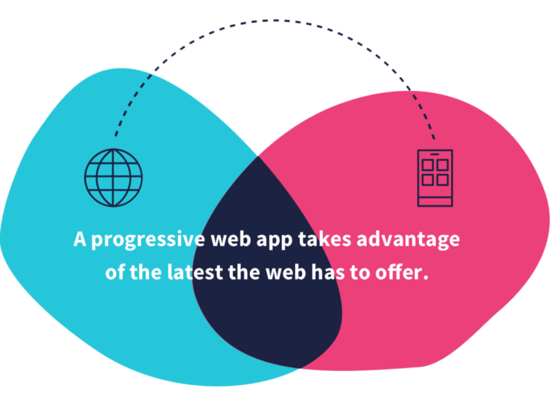
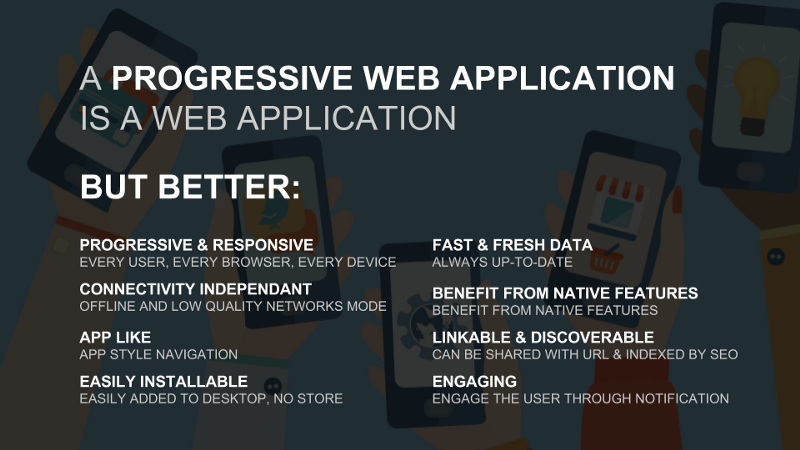
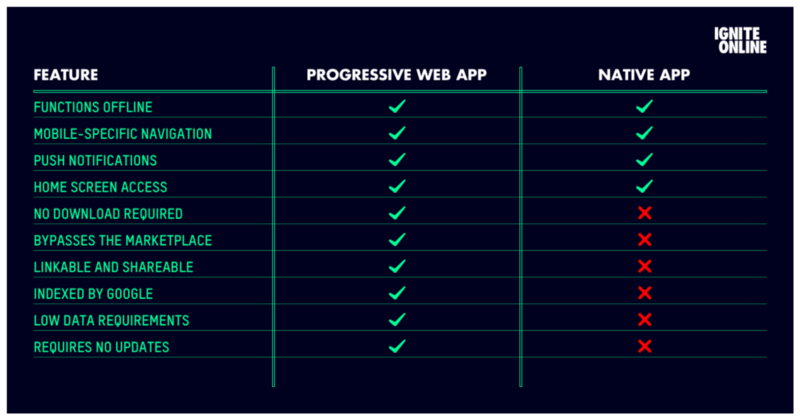
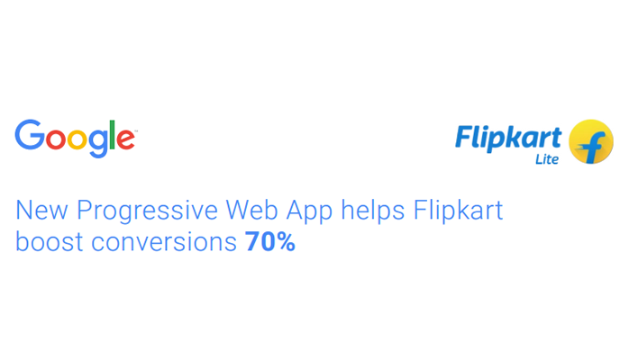
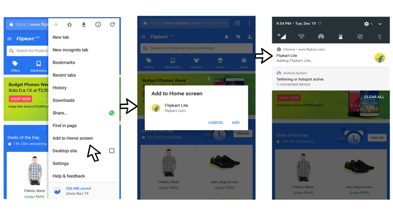

By now you must have heard this buzz word called “ **Progressive Web App** ”. Let me give you a simple definition about PWAs.

> Progressive Web Apps are Web Apps which combines the best features of Web and Native Apps. It is progressive because it is constantly progressing.

### Why Progressive Web Apps?

Now let’s talk about the “_WHY”._ Why [Frances Berriman](https://medium.com/u/ffd9b3451626) and [Alex Russell](https://medium.com/u/fa63e1e8071) came up with a concept called Progressive Web Apps? Before that let’s understand what problems does it solves.

#### Problems with Native Apps?

We all have used Android or iOS apps on our smartphones. We use them for all kinds of thing. But while installing any Android/iOS apps we go through these problems :

1.  **Is this app worth downloading**?
2.  **Do I have enough space**?
3.  **My available data is not sufficient**.

One recent survey shows that people are **turning away from Android/iOS apps,** because not all app experiences are satisfying or worthwhile. Some people simply don’t want any more apps on their phone, some even hesitate to download any app.

If you take a look at the apps installed on your mobile right now there might be at least a dozen apps that you do not use regularly. Sometimes apps only works good when the phone has an active internet connection.

The irony is that most of the apps have a fully responsive website performing the same functions. So why waste your precious disk space and your internet data on your smartphone by installing the native app? The average size of apps that we install from play store/app stores would range from 30–200MB. Moreover, these app needs to updated every week! But Progressive Web Apps are within some KBs and are automatically updated. Thanks to service worker. 🙂

> What if a website can do that and much more than a Native app? This is what Progressive Web Apps (PWA) are trying to accomplish.

In short, **Progressive web apps** combine everything that is great about a native mobile application with everything that is great about a mobile website.

Some other ways I like to describe them:

> “Web apps upgraded to be first-class apps”

Or:

> “The best of the web, plus the best of native apps”

Or, in [Alex](https://medium.com/u/fa63e1e8071)’s words:

> “Just websites that took all the right vitamins”

#### Features of PWAs:

-   **Progressive** — The word progressive means it works for every user, regardless of browser choice because they’re built with [progressive enhancement](https://en.wikipedia.org/wiki/Progressive_enhancement) as a core tenet.
-   **Responsive** — Automatically adjustable to any form: desktop, mobile, tablet etc.
-   **Load Time** — Progressive Web Apps are instantly available
-   **App-like** — Feels like a mobile app with app-style interactions since it’s built on the app shell model.
-   **Fresh** — Always up-to-date so you do not need to update it again and again like any other Android/iOS apps.
-   **Safe** — Served via HTTPS to ensure content is securely delivered
-   **Engaging** — Features like push notifications, etc. makes it very engaging.
-   **Installable** — Allows users to install the website as an app on their home screen without the taking user to an app store.
-   **Linkable** — Easily shared via a URL and do not require complex installation.

#### Benefits of making a Progressive Web App rather than building a fully functional Android App?

-   **Cost Effective** — For an app publisher, the biggest advantage is the cost saving in terms of app development and maintenance. Because it is assumed that making a website is lot more easier than making a Android App.
-   **Cross Platform** — Unlike any other apps, Progressive Web Apps are not restricted to any specific platform. That means you do not need to develop separate versions of app for different platforms.

### 10 REASONS PROGRESSIVE WEB APPS WILL BE THE FUTURE OF APPS

[**10 Reasons Progressive Web Apps Will Be the Future of Apps**  
_When mobile first started out, websites had to create separate mobile websites which had less content than their…_torquemag.io](https://torquemag.io/2017/11/10-reasons-pwas-will-future-apps/ "https://torquemag.io/2017/11/10-reasons-pwas-will-future-apps/")

### Some Popular Companies that Do Progressive Web Apps

-   [Ola](https://developers.google.com/web/showcase/2017/ola)
-   Flipkart
-   Pintrest
-   [Twitter](https://developers.google.com/web/showcase/2017/twitter)
-   [Alibaba](https://developers.google.com/web/showcase/2016/alibaba)
-   [BookMyShow](https://developers.google.com/web/showcase/2017/bookmyshow)
-   [MakeMyTrip](https://developers.google.com/web/showcase/2017/make-my-trip)
-   [OLX](https://developers.google.com/web/showcase/2017/olx)
-   [The Weather Channel](https://developers.google.com/web/showcase/2016/weather-channel)
-   [Forbes](https://developers.google.com/web/showcase/2017/forbes)
-   JioCinema
-   Trivago

### [Introducing Flipkart Lite — The progressive mobile web app](https://www.youtube.com/watch?v=MxTaDhwJDLg)

Flipkart, India’s largest e-commerce site, decided to combine their web presence and native app into a Progressive Web Application that has resulted in a 70% increase in conversions. Flipkart’s PWA takes merely 100KB to download, is 100 times smaller than the 10MB Android app and 300 times smaller than the iOS app. Repeat visits take less than 10KB to download.

### How to use a Progressive Web App?

Probably, you must be wondering how to use a Progressive Web App! Well, you can just click on any links mentioned above. But provided that you must be using a smart phone in order to install it your own device.

Now let’s click open [Flipkart](https://www.flipkart.com/) in chrome. ( _You must be using a Mobile Device_ ). Below are some screenshots which demonstrates the installation of a PWA.

### Chrome Dev Summit Announcments:

EmProgressive Web Apps: Great Experiences Everywhere (Google I/O ‘17)bed placeholder 0.27575581520076975

_Update: At Chrome Dev Summit, Google also shared a_ [_preview of PWA functionality coming to the standard desktop Chrome browser in 2018_](https://youtu.be/_sLa0qhuqcA?t=32m31s)_!_

#### Microsoft is supporting Google’s Progressive Web Apps platform and that’s great news for everyone.

Microsoft [recently announced](https://www.windowscentral.com/microsoft-teams-and-progressive-web-apps-coming-soon-windows-store) that Progressive Web Apps (PWA) will soon be supported by the Microsoft Edge web browser. Moreover, a few apps hitting the Windows Store — like Slack and [Trello](https://www.windowscentral.com/trello-launches-official-desktop-app-windows-store) — are now mixing PWA with Electron and elements of the Universal Windows Platform (UWP).

[**Microsoft is supporting Google’s Progressive Web Apps platform and that’s great news for everyone**  
_Progressive Web Apps (PWAs) are an increasingly important piece of the app puzzle. But it’s not just Microsoft pushing…_www.windowscentral.com](https://www.windowscentral.com/faq-progressive-web-apps-windows-10 "https://www.windowscentral.com/faq-progressive-web-apps-windows-10")

**I hope this has helped to get a good undersanding about Progressive Web Apps, but if not, please leave a comment or** [**tweet me**](https://twitter.com/SouravInsights)**.** Oh and if you’re interested in Progressive Web Apps, you might like to join the [Slack community](https://bit.ly/join-pwa-slack)!

