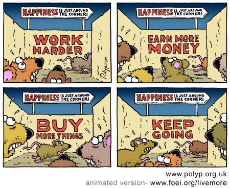

-   I believe that humans are no different. Just like technology, _we are also programmed_. When we enter this world our programmers are usually our parents, who instill their values and beliefs in us. They tell us about the world and people around us and we tend to base our thoughts and beliefs on their views and values. Many individuals believe that what our parents have instilled in us is the right way to go and many do not want to see the world another way. But, can what our parents instill in us be based on false information? I believe so.
-   Often individuals base their beliefs on what they see or hear that may not be true.   
    When a software is built, it went through many phases. Likewise humans have 3 phases.

> _Born | Deploy | Die_

-   Let me explain. When we born we get deployed to schools where we’re programmed how to mug up. Our so called teachers, our programmers emphasizes children’s report cards, instead of making them understand and apply what they are learning. Our parents are just worried about our marks even if they aren’t they are disturbed by the society. **Hang on,** how can forget this. We all had a very popular character in our life, our so called Sharma Ji. Every indian guy will remember him.

> **_"Enough studies, now go play today!" "Take some time out daily to dance, that’s what you like!"_**

-   These kids never hear these sentences. All they hear is _"now go study."_ If these students were allowed to relax daily, perhaps they would have developed a healthy resistance against the pressures of life. But no. These young people were instead pushed beyond their limits to achieve an always-going-after-marks lifestyle. _"You are only worthy if you get the highest marks."_

#### How many of you have heard this sentence?

> " If you guys don’t study, it is your loss only. I will get my salary at the end of month however bad you guys perform.

-   Then we get deployed to college. Where we get programmed to learn hierarchy. The teacher is the authority in the classroom. In our years in the educational system, many of us become obsessed with hierarchy. _We think we’re leaders if we’re the “boss,” and if we’re not the boss, we should simply do as we’re told._ We’re programmed to serve ourselves — to improve our individual grades, to compete for individual positions, and to maximize our own achievements, employment and placements.
-   We are programmed not to be different, just follow what everyone else is doing. Every career decision is approved by our parents and society. We are just afraid of making a mistake and being pointed at. This comes from the very fact that since childhood, our teachers will label anyone different to be a "problem child" who needs psychiatric help, thanks to their limitations as incomplete human beings. Let me introduce to a very popular algorithm, **The Rat Race,** all of us are a part of this pointless, unrealistic and sometime suicidal rat race.

> It’s important to remember that some individuals may program false information into our database which causes us to be mislead. It’s important to remember that what we are told are not necessarily the truth. We should always be careful about what we hear, before we allow others to program negative thoughts into our databases.

Lastly I want say one thing. **Do not try to program your next generation.**

My website : [https://souravinsights.netlify.com/](https://souravinsights.netlify.com/)

My blog : [https://mydeepinsights.wordpress.com/](https://mydeepinsights.wordpress.com/)