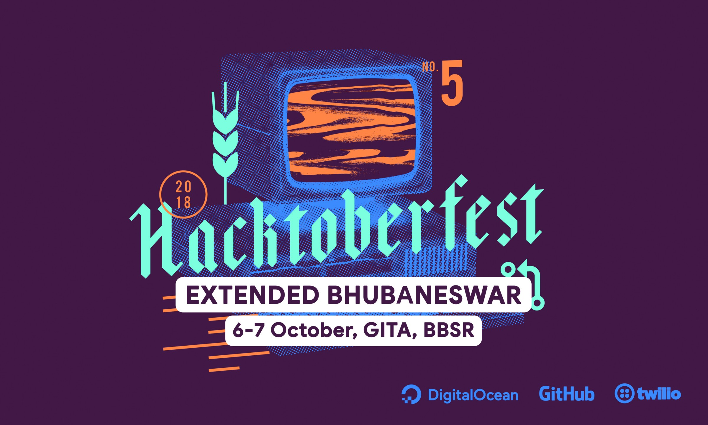
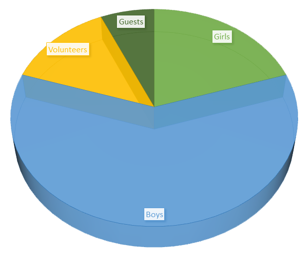
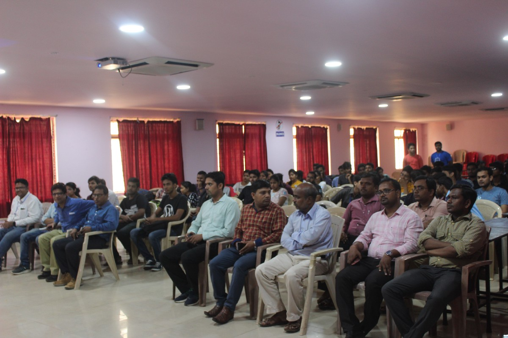
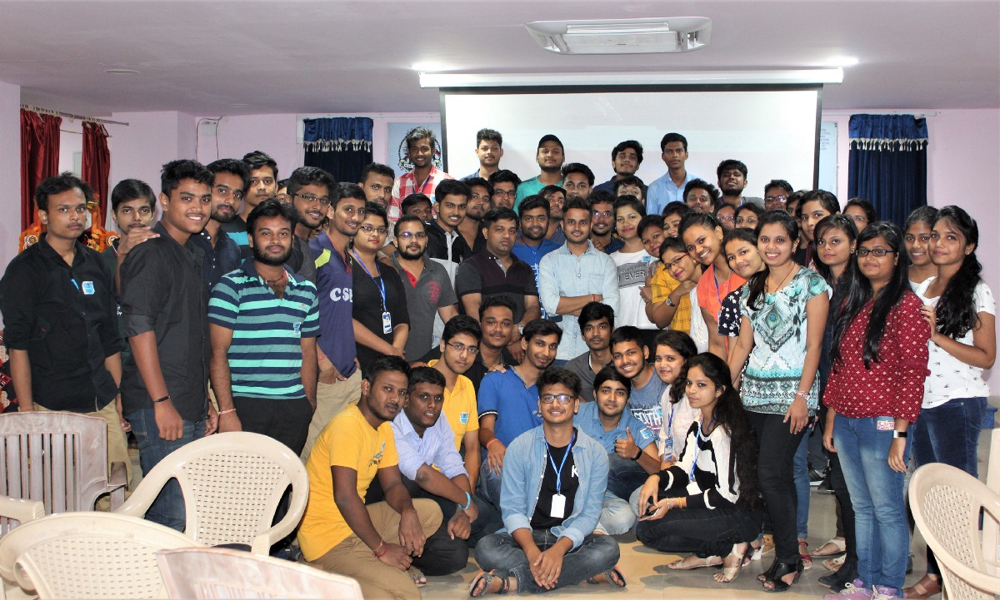
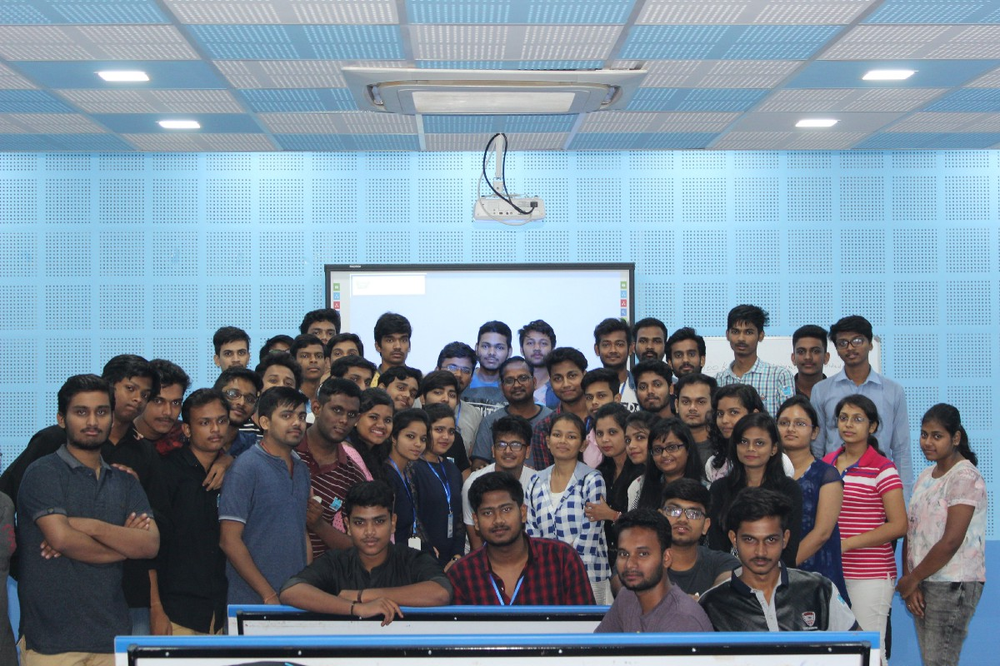
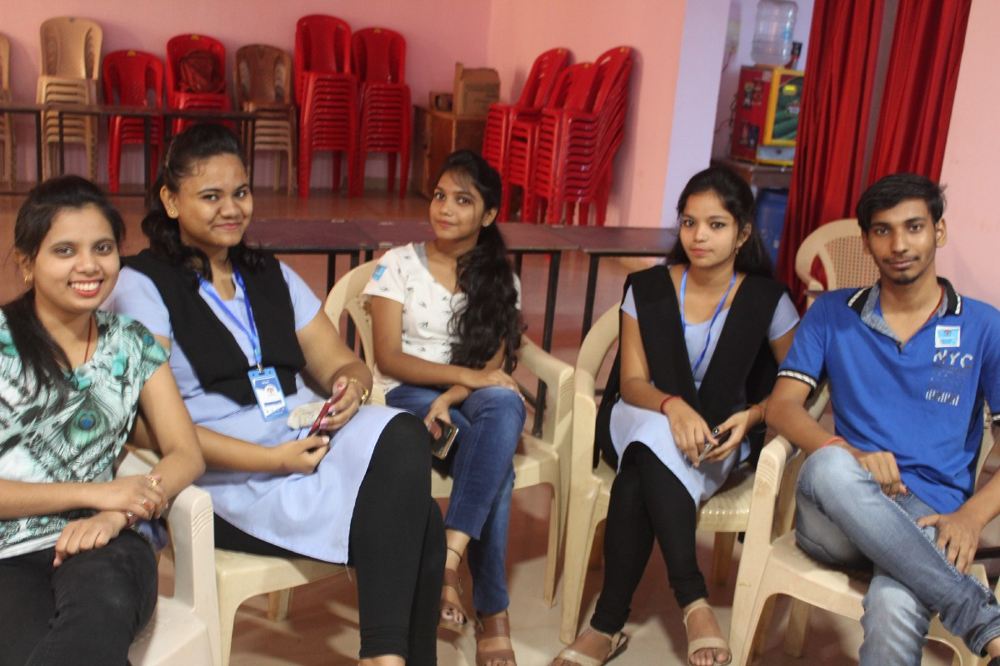
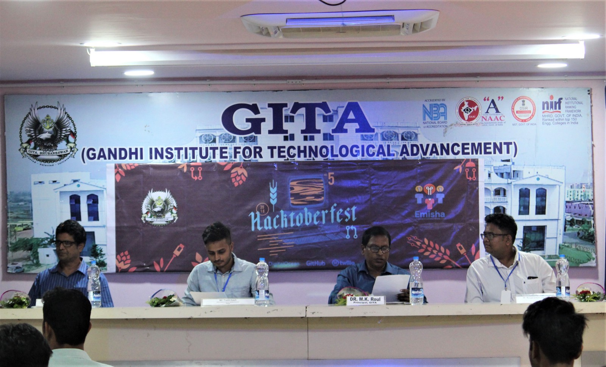
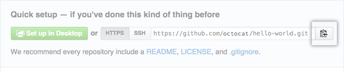
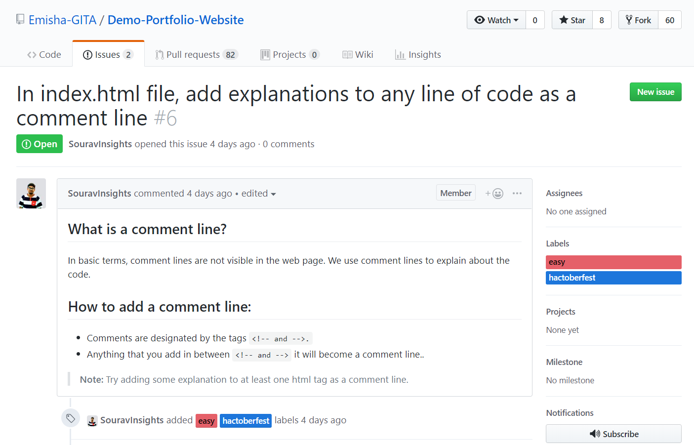

### Why did we Organize this event ❓

Before blabbering about the event, it’s important to know the **motive** and the “**WHY**” of this event.

-   Introduce **Open Source** to newcomers
-   Why learn **version control** systems?
-   [Why you should start using **GitHub**](https://codeburst.io/why-you-should-start-using-github-right-now-e817d213c6ff)?
-   How to [**get started**](https://www.hackerearth.com/getstarted-opensource/) with Open Source?
-   Why it’s important to contribute to the **Open Source Ecosystem?**
-   How can you **earn money** from your Open Source Contributions?

### Summary:

The event was focused on bringing various students into open source software development. It was an attempt to introduce Open Source to all the attendees. Let’s summarize what we did in **Hacktoberfest**:

-   About the community and ways to get involved.
-   What is Open Source and how to get started?
-   What is Hacktoberfest and the benefits?
-   How Open Source matters to IT Companies?
-   Why contribute to Open Source and it’s impact in your career?
-   Personal experience with Open Source
-   Workshop on Git & GitHub
-   Hack began

### Our Sponsors:

-   A big shout-out 📢 to [GitHub](https://medium.com/@github) who supported us for arranging everything. This event would not have been possible without the help from [**GitHub**](https://github.com/)**.**
-   Thanks to  [**JetBrains**](https://www.jetbrains.com/) for giving out software licenses and the awesome swags.

### Demographics:

We had around 95 participants from different colleges of Bhubaneswar. Among 95 participants we had around 30 girls which is an achievement but it’s still very low and we’re trying to improve this ratio soon.







### Guests and Speakers:

1.  [Prof. (Dr.) Manmatha K. Roul](https://www.linkedin.com/in/dr-manmatha-roul-a467948a/) - Principal, Gandhi Institute for Technology Advancement
2.  Prof. Tarini Prasad Panigrahi- H.O.D of Computer Science Department, Gandhi Institute for Technology Advancement
3.  [Mr. Tadit Dash](https://www.linkedin.com/in/taditdash/) - Senior Software Engineer, Microsoft MVP, Tedx Speaker
4.  [Mr. Surya Narayan Barik](https://www.linkedin.com/in/surya-narayan-barik-15961a8b/) - Software Engineer (R&D Department), ProcessMAP Pvt Ltd.



### Important takeaways from Hacktoberfest:

#### 1\. What is Open Source?

Open Source Software is a computer software whose source code is made publicly available for modification and enhancements. It is released under various licenses like BSD, MIT etc. Read this article about “[What is open source?](https://opensource.com/resources/what-open-source)”

#### 2\. Recap of what we did in Git & GitHub workshop:

While we made sure that every attendees must have a Git cheat sheet but still I’d like to briefly mention the things we did in the event.

1.  [Create a new repository](https://help.github.com/articles/creating-a-new-repository) on **GitHub**. To avoid errors, do not initialize the new repository with _README_, license, or `gitignore` files. You can add these files after your project has been pushed to GitHub.

](./asset-8.png)

2\. Go to your project directory and CD into it.

3\. Initialize the local directory as a Git repository.

```
$ git init
```

4\. Add the files in your new local repository. This stages them for the first commit.

```
$ git add .
```

5\. Commit the files that you’ve staged in your local repository.

```
$ git commit -m “First commit”
# Commits the tracked changes and prepares them to be pushed to a remote repository. 
```

6\. At the top of your GitHub repository’s Quick Setup page, click to copy the remote repository URL.



7\. In the Command prompt, [add the URL for the remote repository](https://help.github.com/articles/adding-a-remote) where your local repository will be pushed.

```
$ git remote add origin remote repository URL
# Sets the new remote
```

8\. [Push the changes](https://help.github.com/articles/pushing-to-a-remote) in your local repository to **GitHub**.

```
$ git push origin master
# Pushes the changes in your local repository up to the remote repository you specified as the origin
```

#### 3\. Hacktoberfest Outline: ( What participants did? )

We had prepared a [GitHub repository](https://github.com/Emisha-GITA/Demo-Portfolio-Website) called `Demo Portfolio Website` with some beginner level issues where around 92 pull requests got generated by the participants.



But this contribution didn’t mean much in the open source world. They needed to know about the real issues from open source projects that matter. So we talked more about how to find issues in GitHub, how _labels_ help, how we can filter issues by labels or languages. ( Check out this [website](http://issuehub.io/) to easily search issue labels to find the right project for you. )

#### 4\. Ways you can enhance your Hacktoberfest contributions:

Want to do more and win some extra T-shirts? 👕 Then contribute to the following OSS Projects:

-   Contribute to SendGrid’s Open Source Projects. Read this [blog](https://sendgrid.com/blog/hacktoberfest-2018-hack-on-sendgrid-open-source-projects/).
-   Participate in Auth0’s Open Source Projects and win some exclusive swags. Read this [blog](https://auth0.com/blog/celebrate-hacktoberfest-with-auth0/).
-   Contribute to [Microsoft’s Open Source Projects](https://open.microsoft.com/2018/09/30/join-hacktoberfest-2018-celebration-microsoft/) and win a limited edition T-shirt. Read this [blog](https://open.microsoft.com/2018/09/30/join-hacktoberfest-2018-celebration-microsoft/).
-   Contribute to [OpenEBS repository](https://openebs.io/hackfests/hacktoberfest-2018) during October 2018 and if you get one accepted pull request you can earn an OpenEBS t-shirt and stickers. The best PR will also receive a laptop. Read this [blog](https://openebs.io/hackfests/hacktoberfest-2018).

#### Helpful links:

1.  [How to Create a Pull Request?](https://www.digitalocean.com/community/tutorials/how-to-create-a-pull-request-on-github)
2.  [A Step by Step Guide to Making Your First GitHub Contribution.](https://codeburst.io/a-step-by-step-guide-to-making-your-first-github-contribution-5302260a2940)
3.  [Hack on Sendgrid opensource projects.](https://sendgrid.com/blog/hacktoberfest-2018-hack-on-sendgrid-open-source-projects/)
4.  [Details of Hacktoberfest from Auth0!](https://auth0.com/blog/celebrate-hacktoberfest-with-auth0/)
5.  [Microsoft is joining Hacktoberfest — and you can win a t-shirt](https://open.microsoft.com/2018/09/18/hacktoberfest-2018-microsoft/)
6.  [Hacktoberfest: My Gateway to Open Source](https://medium.freecodecamp.org/hacktoberfest-my-gateway-to-open-source-f44c8778b022)
7.  [Swag opportunities for developers (not just Hacktoberfest opportunities)](https://devswag.io/)
8.  [A to Z resources for Computer Science students.](https://github.com/dipakkr/A-to-Z-Resources-for-Students)

#### 5\. Various Open Source Programs/Internships out there:

-   [**Google Summer of Code**](https://summerofcode.withgoogle.com/) - It’s a global program focused on bringing more student developers into open source software development. Students work with an open source organization on a 3 month programming project during their break from school.
-   [**FOSSASIA Codeheat**](https://codeheat.org/) - It’s a coding contest for [FOSSASIA projects on GitHub](https://github.com/fossasia/). The contest runs until 1st February 2019. Grand prize winners will be invited to present their work at the [FOSSASIA OpenTechSummit](https://2019.fossasia.org/) in Singapore from March 14th -17th 2019 and will get up to 600 SGD in travel funding to attend, plus a free speaker ticket.
-   [**GirlScript Summer Of Code**](http://gssoc.tech/) - GirlScript Foundation is a Non-profit registered by Government of India, has come up with a unique and India’s first women oriented technical festival. The main motto of GirlScript is not only to encourage gender equality in technical sector but also to help all the beginner in technology who are clueless at the starting phase of their education.
-   You can find a whole list of different open source internship programs from this link: [https://github.com/tapasweni-pathak/SOC-Programs](https://github.com/tapasweni-pathak/SOC-Programs)

#### 6\. Earn money by contributing to Open Source:

Want to get paid for your Open Source for your work? Here’s your call.

[](https://gitcoin.co/)

[**Gitcoin**](https://gitcoin.co/) is an open source bounties platform on the Ethereum blockchain. It facilitate a space that allows open source developers to get paid for their work contributing to open source projects.

Read this awesome [article](https://medium.com/gitcoin/everything-you-need-to-know-about-gitcoin-fe2e3e292a21) by [Vivek Singh](https://medium.com/@vivek.m.singh) to know more about GitCoin.

[**Everything You Need to Know About Gitcoin**  
_Our Mission: “Grow Open Source”_medium.com](https://medium.com/gitcoin/everything-you-need-to-know-about-gitcoin-fe2e3e292a21 "https://medium.com/gitcoin/everything-you-need-to-know-about-gitcoin-fe2e3e292a21")[](https://medium.com/gitcoin/everything-you-need-to-know-about-gitcoin-fe2e3e292a21)

#### How it works?

1.  **Explore Bounties:** Explore available bounties on the Issue Explorer.
2.  **Express Interest:** Interested on an issue? Click Start Work to express interest through a short form.
3.  **Begin Work:** If the project requires approval, keep an eye out for a notification for a Request to Work confirmation via email prior to begin working. Otherwise, work away!
4.  **Can’t Continue Your Work:** Click Stop Work, and someone else will pick it up.
5.  **Submit Work:** Completed your work?Click Submit Work to send your PR to a repo maintainer for review. Otherwise, work away!
6.  **Work Reviewed:** Submitted work is reviewed and approved by a repo owner.
7.  **Get Paid:** Once your work is approved by the repo maintainer, you’ll get paid!

---

> Here’s an open request to all of our attendees. If you get to learn something new and want to share your experience of your first Hackathon by writing a blog then drop us an Email at [contact@getemisha.tech](mailto:%20contact@getemisha.tech) and we will add you as a writer on Medium and will provide you with some swags for your contribution. **This publication is yours, make it grow!**

**Like** this blog? Then share this article with your friends. 🎉 💝

[](https://www.facebook.com/sharer/sharer.php?u=https%3A//medium.com/getemisha/takeaways-of-hactoberfest-extended-bhubaneswar-2018-b1b69ccc9112)[](https://twitter.com/home?status=Important%20takeaways%20from%20Hactoberfest%20Extended%20Bhubaneswar%0ARead%20the%20blog%3A%20https%3A//medium.com/getemisha/takeaways-of-hactoberfest-extended-bhubaneswar-2018-b1b69ccc9112%0A%0A%23Hactoberfest%20%23getemisha%20%40emisha_gita%0A%40souravinsights)

_If you want to have a longer chat about the event, our community, our future plans or if you are interested to_ **_sponsor_** _us for our next event, feel free to contact us here_ [**_contact@getemisha.tech_**](mailto:%20contact@getemisha.tech)